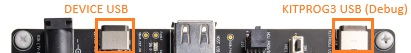
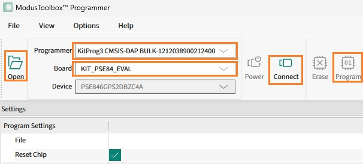

## Introduction

This document demonstrates the steps of setting up and evaluating the 
Infineon PSOC™ Edge E84 Evaluation Kit (KIT_PSE84_EVAL) MCU board
for connecting to Avnet's /IOTCONNECT Platform with device-generated certificates
while using the pre-built firmware.

If you wish to experience the development environment and build the formware
see the [Developer Guide](DEVELOPER_GUIDE.md).

## Prerequisites
* A USB-C Cable. The board package will contain a USB-C to USB-A cable.
* A Wi-Fi Network.
* A registered [myInfineon Account](https://www.infineon.com/sec/login)
* A serial terminal application such as [Tera Term](https://ttssh2.osdn.jp/index.html.en) or a browser-based application like [Google Chrome Labs Serial Terminal](https://googlechromelabs.github.io/serial-terminal/).
Tera Term can be installed by launching PowerShell and executing:

```powershell
winget install -e --id TeraTermProject.teraterm
```

## Hardware Setup

* Ensure the following jumper and pin configuration on board.
  * BOOT SW must be in the LOW/OFF position. NOTE: This is the default configuration for a shipped board, but different from most other Avnet projects.
  * J20 and J21 must be in the tristate/not connected (NC) position (these should be default)
* Identify the two debug USB port for your board from the board's user manual:
  


* The board can be powered with either of the two ports that are marked on the image above.
The two USB-C ports are used for different purposes:
  * The **KITPROG3 USB** port - *Cypress Semiconductor KitProg3 CMSIS-DAP* - used for flashing, debugging and application log messages.
  * The **DEVICE USB** port - *Infineon Technologies Avnet CDC Configurator* - used for user interaction and runtime board configuration.
* When connecting a Serial Terminal program to either of the two ports, configure the connection as shown below:
  * Port: (Select the desired COM port)
  * Speed: `115200`
  * Data: `8 bits`
  * Parity: `none`
  * Stop Bits: `1`
  * Flow Control: `none`

## Installing the Required Software

- Download [ModusToolbox&trade; software](https://www.infineon.com/cms/en/design-support/tools/sdk/modustoolbox-software/). Install the ***ModusToolbox&trade; Setup*** software. The software may require you to log into your Infineon account. In ***ModusToolbox&trade; Setup*** software, download & install the items below:
  - ModusToolbox&trade; Programming Tools 1.7.0 or 1.6.0

## Flashing The Firmware

* Download the [avnet-iotc-mtb-psoc-edge-psa-tfm-v1.1.0.zip](https://downloads.iotconnect.io/partners/infineon/demos/avnet-iotc-mtb-psoc-edge-psa-tfm-v1.1.0.zip). Unzip the file to a location of your choosing.
  
* Connect the USB cable to the **KITPROG3 USB** port on the board.
* Run the ModusToolbox Programmer application. On Windows you can use the *Search* feature in the taskbar.
> [!NOTE]
> The Programmer application version will not match the version listed above. 
> The programmer GUI has its own version and will likely be shown as 5.7.
>
* Click the **Open** icon in the toolbar and select the extracted *avnet-iotc-mtb-psoc-edge-psa-tfm.hex* from the zip file
, then click the **Open** button in the dialog.
* In the **Programmer** pulldown, Select *KitProg3 CMSIS-DAP-BULK-XXXXXXXXXX*.
* In the **Board** pulldown, Select *KIT_PSE84_EVAL*.
* Click the **Connect** button on the toolbar. The programmer should connect to the board.
* Click the **Program** button on the toolbar. The programmer should flash the application.




## Running the Firmware

* Disconnect the **KITPROG3 USB** port from the board.
* Connect the board's **DEVICE USB** (see the picture above) USB-C port to your PC, 
run a terminal program and connect it to this port.
* Press the ENTER key on your keyboard into the terminal window to trigger the welcome message.
* If you do not see the welcome message after pressing the ENTER key in the terminal
, try resetting the board and re-connecting your terminal software.
* The welcome message will show your device's generated certificate
and recommended Device Unique ID (DUID) for your device:
```
Welcome to the /IOTCONNECT Device Configurator.
This device certificate:
-----BEGIN CERTIFICATE-----
MIIBfzCCASagAwIBAgIIetSABxoGATMwCgYIKoZIzj0EAwIwOTEaMBgGA1UEAwwR
SW9UQ29ubmVjdERldkNlcnQxDjAMBgNVBAoMBUF2bmV0MQswCQYDVQQGEwJVUzAg
Fw0yNTAxMDEwMDAwMDBaGA8yMDUwMDEwMTAwMDAwMFowOTEaMBgGA1UEAwwRSW9U
Q29ubmVjdERldkNlcnQx                  V0MQswCQYDVQQGEwJVUzBZMBMG
ByqGSM49AgEGCCqGSM49      EXAMPLE     g+MlGLdObYvkq/g5gQviHRORFk
VkUVNf9QM3CF+hyWvlUx                  yaZee+45OODdOjFjAUMBIGA1Ud
EwEB/wQIMAYBAf8CAQAwCgYIKoZIzj0EAwIDRwAwRAIgN6L7vek/hmtaRVyFGB2p
jyd9MDu4sO7AJgVJEYQ+eWICIBOQkeCd90nGVunmkA3HKjGWf53cFgeN2alEsrSt
2qRo
-----END CERTIFICATE-----

Suggested Device Unique ID (DUID): pedge-psa-3301061b
```

This generated certificate will be unique and always the same for each device.
The certificate will be used to create your device in /IOTCONNECT Web UI.

> [!NOTE]
> If you need to re-generate the certificate, you will need to
> build a modified version of the firmware. 
> Refer to the [DEVELOPER_GUIDE.md](DEVELOPER_GUIDE.md) for this. 

Using the suggested device ID is optional. You can create a device with any name.

## Cloud Account Setup

### Create /IOTCONNECT Account
An /IOTCONNECT account with an AWS backend is required.  If you need to create an account, a free trial subscription is available.
The free subscription may be obtained directly from [iotconnect.io](https://iotconnect.io) or through the AWS Marketplace.

* Option #1 **(Recommended)**   
/IOTCONNECT via [AWS Marketplace](https://github.com/avnet-iotconnect/avnet-iotconnect.github.io/blob/main/documentation/iotconnect/subscription/iotconnect_aws_marketplace.md) - 60 day trial; AWS account creation required  


* Option #2  
/IOTCONNECT via [iotconnect.io](https://subscription.iotconnect.io/subscribe?cloud=aws) - 30 day trial; no credit card required

> [!NOTE]
> Be sure to check any SPAM folder for the temporary password after registering.

Login to the platform by navigating to [console.iotconnect.io](https://console.iotconnect.io)

### /IOTCONNECT Device Template Setup

An /IOTCONNECT *Device Template* will need to be created or imported.
* Download the premade [device-template.json](files/device-template.json) 
(Open the link first, then click the **Download Raw File** icon on the right).
* Import the template into your /IOTCONNECT instance:  [Importing a Device Template](https://github.com/avnet-iotconnect/avnet-iotconnect.github.io/blob/main/documentation/iotconnect/import_device_template.md) guide  
> **Note:**  
> For more information on [Template Management](https://docs.iotconnect.io/iotconnect/concepts/cloud-template/) 
> please see the [/IOTCONNECT Documentation](https://iotconnect.io) website.

### /IOTCONNECT Device Setup

In this step, we will create a **Device** associated with the previously imported **Device Template**.

* In the sidebar, navigate to Devices->Device page and at the top-right, click **Create Device**. 
See [this short guide](https://github.com/avnet-iotconnect/avnet-iotconnect.github.io/blob/main/documentation/iotconnect/create_new_device.md)
for detailed navigation steps.  
* Enter a **Unique ID** (also called a **DUID**) of your choosing, 
or the unique ID suggested by the Device Configurator above like *pedge-psa-3301061b*.
* For simplicity, in the **Device Name** enter the same **Unique ID**. 
* Select the **Entity** to associate the device (For new accounts, there is only one option).  
* Select the previously imported template *pedgepsa*.
* Under **Device Certificate** select **Use my certificate**.
* Copy and Paste the device certificate printed on the Device Configurator terminal above, including the BEGIN and END lines
into the **Certificate Text** field.
* Click **Save & View**.
* Either copy (click the *Copy* icon on the right) or download the **Device Configuration Information** 
by clicking the icon in the upper right of the device *Info* panel page.  
.


## Configuring the Firmware

* Restart or resume the Device configurator terminal session
while the device is connected to the **DEVICE USB** port.
* Follow the on-screen instructions:
  * Enter your Wi-Fi SSD and password when prompted. Empty password can be entered for open networks.
  * Copy and paste your **Device Configuration Information** from the step above. Press CTRL-D on your keyboard when done. 
* Disconnect **DEVICE USB** port and connect it to the **KITPROG3 USB** port.
* The device should connect to /IOTCONNECT and start sending messages similar to this one:

```
>: {"d":[{"d":{"version":"M-1.1.0","random":37,"event_id":4,"event":"left_edge","event_detected":true}}]}
```
